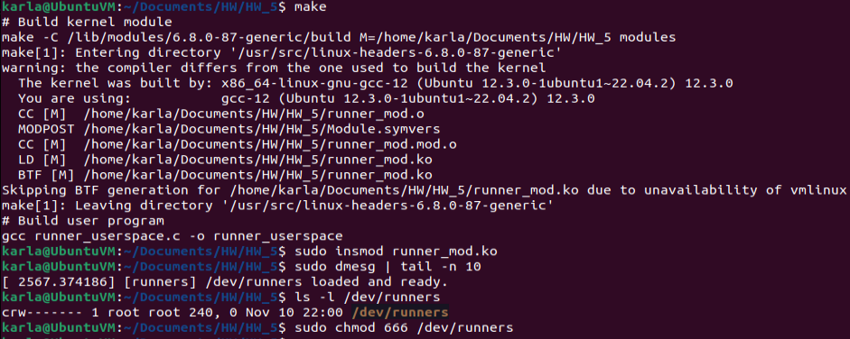
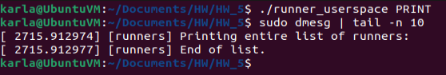
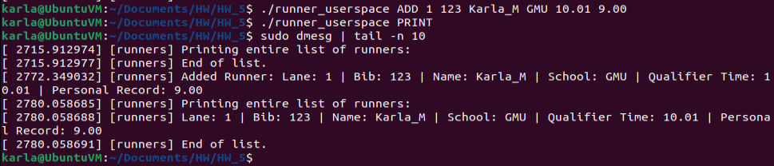
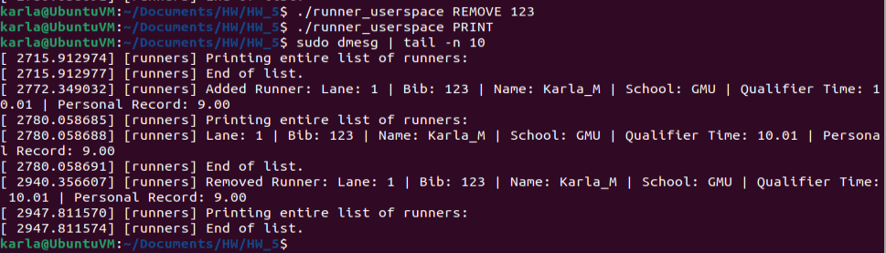
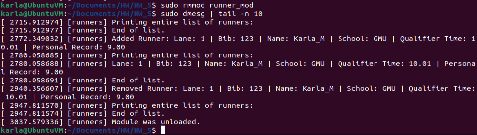
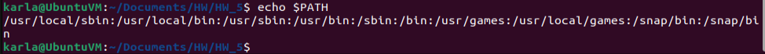

# Linked List Character Device Driver

This device driver is based on a linked list program I originally wrote in user space, but rewritten to run in the Linux kernel. The node management was adapted to use `kmalloc` and `kfree` for memory allocation, the kernel’s `struct list_head` for linked list handling, and a mutex to ensure safe access to shared data. Here is the [original doubly linked list implementation](https://github.com/kmejia8/Doubly-Linked-Track-Meet)!

The following code creates a character device driver that will implement a linked list for runners at a track meet. Each runner will have data saved for them, including their lane, bib number, name, school, qualifier time, 
and record time. With the help of a userspace program, different commands will be supported, including printing the list of runners, adding a runner, and removing a runner. All of the outputs will be able to be seen via the kernel.

`runner_mod.c`: module for the linked list, which will contain all of the logic for the linked list

`runner_userspace.c`: userspace program, will help to parse commands from the user

`Makefile`: contains commands to easily build and clean up both the userspace code and the kernel code

All of these files must be saved in the same directory to work.

## How to Build

First navigate to the directory where all of the files are saved. Next, build both the kernel module and user program:

```
make
```

This should create the following files:

```
runner_mod.ko
runner_userspace
and others...
```

## How to Load the Character Device Driver

Initialize the kernel module:

```
sudo insmod runner_mod.ko
```

To verify it loaded:

```
sudo dmesg | tail -n 10
```

This should show a message confirming that the device has been loaded and is ready to use via the kernel.


Check for `/dev/runners`:

```
ls -l /dev/runners
```

This confirms that the device driver was created successfully

## How to Interact with the Userspace Program
To ensure the userspace program is able to write properly, run the following command to give the file the proper permissions:
```
sudo chmod 666 /dev/runners
```


To run commands via the userspace program, start off commands with the following:

```
./runner_userspace
```

## Commands

### Adding a runner:
```
./runner_userspace ADD <lane> <bib_number> <name> <school> <qualifier_time> <personal_record>
```
Example:
```
./runner_userspace ADD 1 123 Karla_M GMU 10.01 9.00
```

### Removing a runner:
```
./runner_userspace REMOVE <bib_number>
```
Example:
```
./runner_userspace REMOVE 123
```
### Printing the list of runners:
```
./runner_userspace PRINT
```

### View changes to List:

```
sudo dmesg | tail -n 10
```

## How to Unload the Driver

```
sudo rmmod runner_mod
```

Then, confirm it unloaded with:
```
dmesg | tail -n 10
```

## Example Run

First, the files were made and the character driver was loaded. Afterwards, it was confirmed via the kernel and /dev/ file that the module was loaded and the device driver file was created.



Afterwards, we can confirm that the linked list is empty by using the `PRINT` command.



Now we test adding a runner. The following runner was added:
- Lane: 1
- Bib: 123
- Name: Karla_M
- School: GMU
- Qualifier Time: 10.01
- Record Time: 9.00

Looking at the output of the kernel, we can see that originally the list was empty, but after running ADD, we can see that the runner was added to the list when running PRINT. It was also confirmed when running ADD, as the info of the runner was printed then.



Next, we removed the runner using their bib number (123). The output shows that after running REMOVE, the runner with the bib number 123 has been removed and the list is now empty again.



At the end, we unloaded the module, which was confirmed via the output of the kernel.



Attached is the `$PATH` of the directory.



